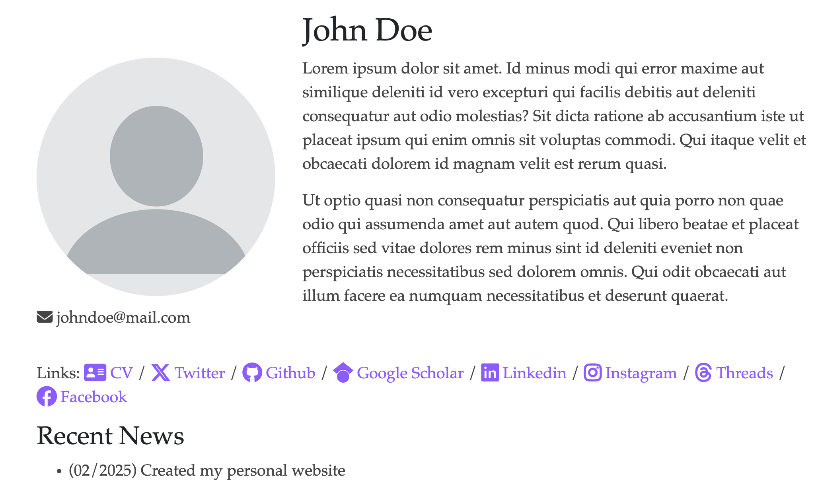

# Personal Website Template

While building my own academic website, I spent countless hours looking at other researchers' websites and learning from their designs. After finally getting mine to a place I was happy with, I thought it might be helpful to share my template with others who might be on the same journey.

This is a simple template built with HTML, CSS, and Bootstrap 4 that I use for my own website. It's designed to be easy to customize and includes sections for the things most academics need - publications, projects, and other work. If you're looking to create your own academic website, feel free to use this as a starting point and modify it to better suit your needs.

## Getting Started

1. Click the **"Use this template"** button at the top of this repository
2. Clone your new repository to your local machine
3. Customize the template with your information:
   - Update `index.html` with your personal information
   - Replace `img/profile.png` with your profile picture
   - Replace `img/site-logo.png` with your website logo
   - Modify the content in each section according to your needs -> replace the placeholder image with your actual image
   - Update social media links and icons
  
## Customization Guide

### Basic Information
- Update the `<title>` and meta tags in `<head>` section
- Replace profile information in the header section
- Update email address and social media links

### Sections
- **Publications**: Add your publications following the existing card format
- **Projects**: Showcase your projects using the provided template structure
- **Honors**: List your achievements and awards
- **Recent News**: Keep the section updated with your latest activities
- **Miscellany**: Add personal interests or additional information

### Styling
- Main styling is controlled by `css/style.css`
    - the main color theme is in purple, you can change the color in the CSS file
    - if you do not like the font, you can change it too
- Bootstrap classes can be modified for layout adjustments
- Font Awesome 6 icons are used for social media and other icons: [[search for icons](https://fontawesome.com/search)] [[style your icon]([text](https://docs.fontawesome.com/))]

## Live Demo

Visit [https://joycenerd.github.io/](https://joycenerd.github.io/) to see the template in action.

## Credits

This template is inspired by and adapted from various academic personal websites. Special acknowledgment to:
- Nelson Liu's [personal website](https://nelsonliu.me/) and [source code](https://github.com/nelson-liu/website)
- Yung-Sung Chuang's [personal website](https://people.csail.mit.edu/yungsung/)
- Ethan Perez's [personal website](https://ethanperez.net/)

## Contributing

Feel free to submit issues and enhancement requests! If you find this template useful, please consider:
1. Giving a ⭐ to this repository
2. Keeping the attribution in the footer
3. Sharing it with others who might benefit from it